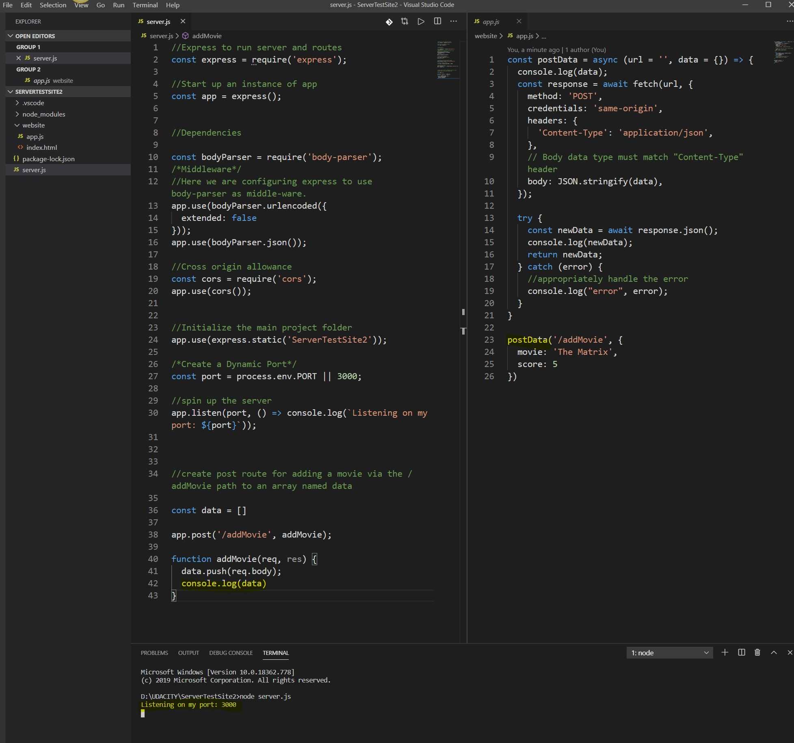

# 100 Days Of Code  - Log :computer:

###  :calendar:Day 3: May 8th, TGIF

**Today's Progress:** 

:arrow_right: I started the morning with Javascript practice problems and refresher on flexbox on <a href='https://www.freecodecamp.org/'>freeCodeCamp.org</a>.

Continued working through Client & Server side lessons on Udacity. 

**Thoughts:** 

:thought_balloon: Still waiting to hear back from my mentor about post routes before moving on to Asynchronous JavaScript with the Fetch API and more about Web APIs.

**Articles to keep in mind:** 
:bookmark: <a href='https://link.medium.com/ADBhCNtwj6'>Quick Git setup</a>
:bookmark: <a href='https://dev.to/caroso1222/the-ultimate-8-bullet-checklist-to-ace-the-full-stack-interview-project-323m'>The Ultimate 8-bullet checklist to ace the Full Stack Interview Project</a>
 

#####  

###  :calendar:Day 2: May 7th, Thursday

**Today's Progress:** 

:arrow_right: I started the morning with Javascript practice problems on <a href='https://www.freecodecamp.org/'>freeCodeCamp.org</a>.

:arrow_right: Watched a follow along video by <a href='https://www.youtube.com/watch?v=pKd0Rpw7O48'>Programming With Mosh</a> on RESTful API's.

Continued working through Client & Server side lessons on Udacity. Should be ready to create my own weather app, sometime next week. I have a few questions for my mentor related to the console data on the terminal and why it's not displaying properly. Should hear back soon and fix. 

**Thoughts:** 

I need to continue working on javascript so that it stays fresh in my mind. So happy to have found extra resources regarding Node Express. 

 

#####  

###  :calendar:Day 1: May 6th, Wednesday

**Today's Progress:** 

:arrow_right:I read documentation on Node and Express. Then I setup my first local server by installing node, express, body-parser and cors. I also learned about the file heirarchy. 

**Thoughts:** Surprisingly easier that I thought it would be. However, there is much more ahead. 
 

#####  
### :calendar:Day 0: May 5th, Tuesday
**Until now**: I've been coding everyday for sometime now, so I'm joining this challenge to help me keep track of my progress :smile:.  
 
**Completed thus far...**

:arrow_right: HackBright Academy beginner Python course

:arrow_right: Udacity's beginner Javascript course

:arrow_right: Hackreactor's begginer to intermediate Javascript bootcamp

:arrow_right: Currently working on Udacity's front end developer course

:star2: Personal Blog Project: <a href='https://github.com/Enid-Sky/blogWebsite'>HERE</a>. Started this project from scratch with my knowledge of HTML and CSS. Makes use of flexbox, grid, and responsive design features.

:star2: Wedding Site Landing Page Project: <a href='https://github.com/Enid-Sky/LandingPageWeddingSite'>HERE</a>. This project features a multi-section landing page with a dynamically updating navigation menu based on the amount of content that is added to the page. It is clear which section is being viewed while scrolling through the page. When clicking an item from the navigation menu, the link should scroll to the appropriate section.

 

